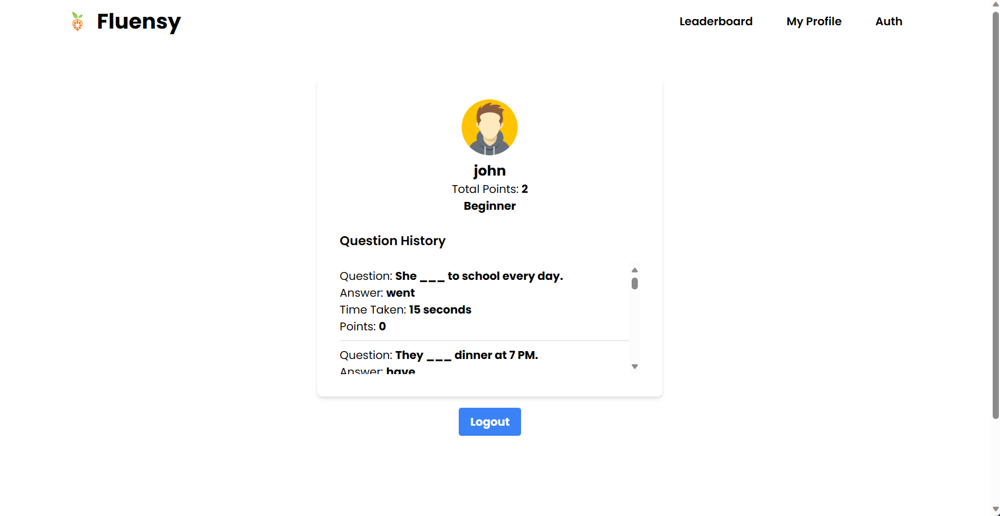
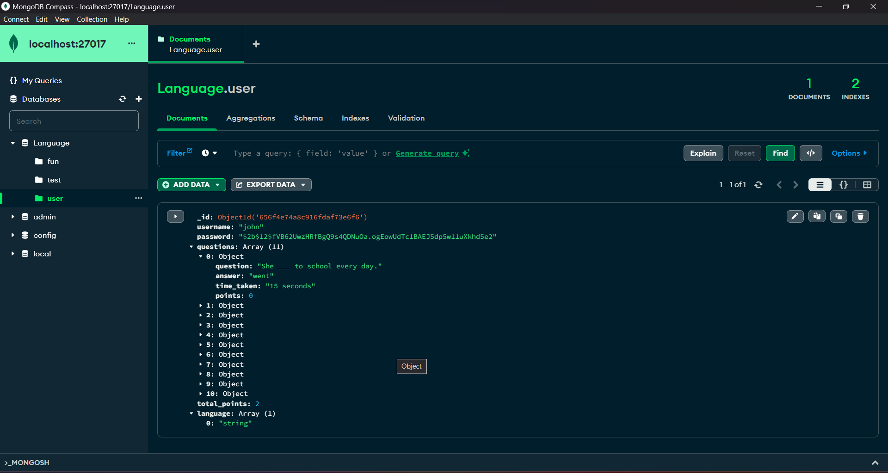

# Fluency - Language Learning App

Fluency is a language learning application designed to facilitate language acquisition through interactive exercises. Admins can create exercises in various languages, while students can answer them to earn points, compete with peers, track their progress, and more.

## Features

- [x] Answer Exercises to Earn Points and Track Progress
- [x] Language Preference Selection Once Uploaded by Admin
- [x] Leaderboard: Top Performers and Competitive Rankings for progress comparison.
- [x] Authentication: Secure Access with login and signup functionalities.
- [x] Responsive Design: Mobile-Friendly for seamless cross-device experience.
- [ ] Exercise Management: Admin Panel to add exercises in different languages.

## Backend Test Link : https://fluencyapp.azurewebsites.net/docs

---

### **How to Set Up & Start the Application**

#### Cloning the Project
1. Clone the project repository:
    ```bash
    git clone https://github.com/Atharva-Malode/Fluency-Language-Learning-app.git
    ```

#### Frontend Setup
2. Navigate to the project directory in the terminal:
    ```bash
    cd project
    cd frontend
    ```

3. Install dependencies:
    ```bash
    npm install
    ```

4. Run the frontend server:
    ```bash
    npm run dev
    ```

#### Backend Setup
5. In a different terminal (e.g., using VS Code terminal):

6. Navigate to the backend directory:
    ```bash
    cd project
    cd backend
    ```

7. Install Python dependencies:
    ```bash
    pip install -r requirements.txt
    ```

8. Start the backend server with Uvicorn:
    ```bash
    uvicorn main:app --reload
    ```

#### Database Setup
9. Ensure MongoDB Compass is installed.

10. Get the connection string from MongoDB Compass.

11. Paste the connection string into `main.py`:
    ```python
    # Inside the connect("") function in main.py
    connect("<usually localhost:27017>")
    ```

12. Note:
    - Ensure you have a database named 'language'.
    - Inside the 'language' database, ensure there is a collection named 'test' and a user present.
      

#### Viewing Swagger Documentation for Backend
13. Access Swagger docs:
    - Navigate to the link (usually localhost:8000) in your browser.
    - Append "/docs" to the link (e.g., localhost:8000/docs) to view the Swagger documentation.

#### Open the Frontend Link
14. Open the frontend application by navigating to [link available in frontend terminal, usually localhost:5173] in your browser.

Your application is now set up and ready to use!

---
### **Frontend Overview**

<!-- First Row -->
<p align="center">
  
  
</p>

<!-- Second Row -->
<p align="center">
  
  
</p>

<!-- Third Row -->
<p align="center">
  
  
</p>

---

### **Backend Overview**

The backend is powered by **FastAPI**, a high-performance web framework for Python APIs, known for its speed and efficiency.

#### Application Structure

- **Entry Point**: `main.py` defines all routes and their functionalities.

#### Routes in `main.py`

- `GET /`: Read Root
- `POST /signup`: Sign Up (required: username and password)
- `POST /token`: Login (required: username and password)
- `GET /user_data`: Get User Data
- `POST /add_question`: Add Question (require: answer submitted by user, whether it is wrong or right, level of the user's answer, points scored, time taken by the user) [add response to database]
- `POST /question`: Get Question (require: question number, old answer correctness, old level of the question, language of the question)
- `GET /leaderboard`: Get Leaderboard

The backend includes Swagger UI, offering an intuitive interface to explore routes, parameters, outputs, and test functionalities.


---
### **MongoDB Overview**

The application utilizes MongoDB, a NoSQL database, to store and manage data efficiently.

#### Database Structure

MongoDB is structured with two collections:

- **Users Collection**: Stores user data including hashed passwords, unique usernames, arrays of questions to track submitted answers, total points, and a list of preferred languages.

- **Tests Collection**: Contains exercises categorized by language. Each exercise includes an array of questions with answer explanations, options, and exercise numbers.

<p align="center">
  
  
</p>
---
